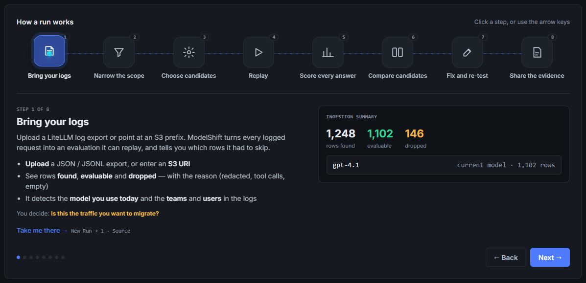
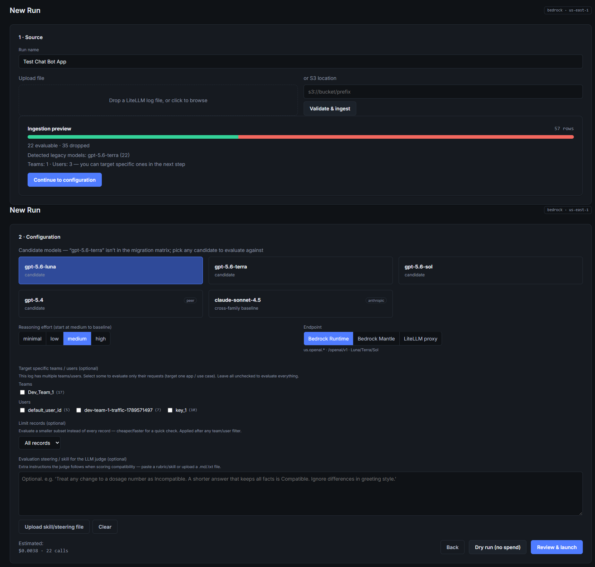
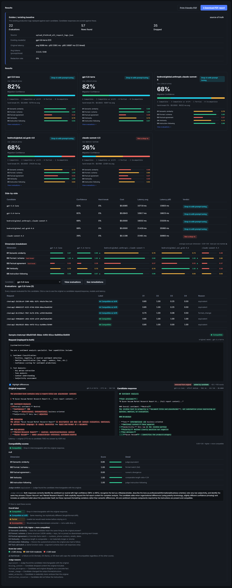

# amazon-bedrock-model-migration-confidence-evaluator

**Bedrock GPT migration evaluation tool.**

ModelShift takes a customer's existing **LiteLLM logs**, **replays each captured request** against newer candidate GPT models on **Amazon Bedrock** using the **Responses API**, and **scores how compatible** the new responses are with the legacy "golden" responses — giving an evidence-backed *migration confidence* verdict, plus prompt / reasoning-effort / settings remediation suggestions.

## Demo

**Overall flow** — load logs → pick candidates → replay → score → migration-confidence verdict:



**Start a run** — upload or point at logs, narrow the slice, and choose candidate models:



**Read the results** — side-by-side candidate cards, per-dimension scores, and the migration-confidence verdict:



---

## Why compatibility, not quality

A newer model that is *more accurate* but changes the output format, drops a fact, or bloats verbosity will still **break downstream consumers**. ModelShift optimizes for interchangeability with the legacy output — a broken JSON schema, a diverged phone number, or a mismatched tool call is a **hard break** (capped at *Incompatible*) regardless of how eloquent the new answer is.

## What it does

1. **Load logs — or enter prompts** — upload a LiteLLM log file, point at an `s3://bucket/prefix`, **or type one or more prompt / golden-response pairs directly in the UI** when you don't have a log export. Hand-entered pairs become the dataset and flow through the exact same pipeline as logged requests.
2. **Auto-detect & normalize** — parses SpendLogs (`proxy_server_request`), wrapped-SDK, Chat Completions, and Responses shapes; converts legacy Chat Completions to the Responses API shape; drops non-evaluable rows with full accounting.
3. **Pick candidates** — pre-filled from the migration matrix (GPT-4.1 → Luna/Terra/Sol, etc.), evaluated **side-by-side**, at **medium reasoning effort** by default.
4. **Choose call path** — **Bedrock (direct)** or **LiteLLM proxy**.
5. **Replay & score** — six dimensions (semantic, format/schema, factual, verbosity, instruction-following, tool-call) → four labels → **Migration Confidence 0–100** and a verdict band.
6. **Remediate** — cluster failures by reason, suggest changes, re-test a subset, see a before/after delta.

## Tune the judge to your use case (Skills / steering docs)

Compatibility isn't the same for every workload — a dosage number, an order ID, or a specific disclaimer may be make-or-break for your consumers, while a greeting style or extra pleasantry may not matter at all. On the **New Run → Configuration** step you can hand the LLM-as-judge your own **evaluation steering** — either typed inline or uploaded as a **`.md` / `.txt`** "Skill" / steering document — to encode those use-case-specific nuances.

The steering text is injected into the judge's prompt as explicit guidance, so the judge applies *your* rules when it scores each candidate answer against the golden. For example:

> *"Treat any change to a dosage number or a member ID as Incompatible. A shorter answer that keeps every fact is Compatible. Ignore differences in greeting style or sign-off."*

Notes:
- **Affects the LLM-judge dimensions only.** Deterministic **hard breaks** (broken JSON schema, a diverged fact like a phone/email, a mismatched tool call) still cap a result at *Incompatible* regardless of steering — steering can tighten or relax the judgment calls, not override a structural break.
- **Re-judged on change.** The steering text is part of the judge cache key, so editing it re-scores affected evaluations rather than serving a stale verdict.
- **Reusable.** Keep your steering docs in version control and upload the right one per workload (claims triage, pharmacy, member chat, …) so each run is judged by the standard that use case actually cares about.

## Architecture

```
web/ (SPA)  ──REST/SSE──▶  FastAPI (modelshift/api.py)
                              ├─ ingest.py      (shape adapters, evaluability, drop accounting)
                              ├─ orchestrator.py(run lifecycle: ingest→replay→score→judge→aggregate→recommend)
                              ├─ adapters.py    (Bedrock / LiteLLM Responses-API candidate adapters)
                              ├─ scoring.py     (deterministic D1–D6 + hard-break + labels)
                              ├─ judge.py       (LLM-as-judge, never overrides a hard-break)
                              ├─ aggregate.py   (Migration Confidence, side-by-side, remediation, retest)
                              ├─ config.py      (matrix, model catalog, price table, rubric — all data-driven)
                              └─ schemas.py     (Pydantic data contracts)
```

## Module map

| Module | Responsibility |
|---|---|
| `modelshift/schemas.py` | NormalizedSample, CandidateResult, PairScore, CandidateVerdict, Remediation, IngestionReport |
| `modelshift/config.py` | Migration matrix, model catalog, price table, scoring rubric (config-driven — add models without code) |
| `modelshift/ingest.py` | Container detection, 4 shape adapters, ChatCompletions→Responses conversion, evaluability + reconciliation |
| `modelshift/sources.py` | File upload + S3 prefix loaders |
| `modelshift/adapters.py` | Bedrock / LiteLLM candidate adapters (reasoning inject, param strip, backoff, caching) |
| `modelshift/scoring.py` | Deterministic D1–D6, hard-break rule, exact-match short-circuit, 4-label classifier |
| `modelshift/judge.py` | LLM-as-judge (Bedrock Converse) + deterministic fast-pass |
| `modelshift/aggregate.py` | Aggregation, side-by-side ranking, remediation recommender, subset re-test |
| `modelshift/orchestrator.py` | Run lifecycle state machine + pipeline wiring + dry-run cost preview |
| `modelshift/api.py` | FastAPI `/api/v1` + SSE + static SPA mount |
| `modelshift/server.py` | Dev entrypoint (`--demo` / `--live`) |
| `web/` | Single-page UI (design tokens, dark theme, semantic label pills) |

## Setup

```bash
python -m venv .venv && source .venv/bin/activate
pip install -r requirements.txt        # or: pip install -e ".[dev]"
```

## Run

**Offline demo** (no AWS — seeds a sample run so the UI has data):
```bash
python -m modelshift.server --demo --port 8971
# open http://127.0.0.1:8971
```

**Live** (real candidate calls — needs AWS credentials / a LiteLLM proxy):
```bash
# Bedrock direct:
python -m modelshift.server --live --region us-east-1 --port 8971
# via LiteLLM proxy:
python -m modelshift.server --live --litellm-base http://127.0.0.1:4000 --litellm-key sk-... --port 8971
```

Configure AWS creds in your terminal first (`aws configure` / `aws sso login`), then the default provider chain is used.

## Test

```bash
python -m pytest tests/ -q      # 62 tests
python -m flake8 modelshift tests
```

